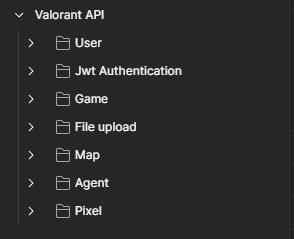

# Web project for the game community

API for my side project made with springboot

<div align="center">
 
</div>


## Features

### Database tables
- [x] Agents
- [x] Games
- [x] Maps
- [x] Pixels
- [x] Users

## Requirements

- [Java 11](https://www.oracle.com/java/technologies/javase-jdk11-downloads.html)
- [Spring](https://spring.io/)
- [Docker](https://www.docker.com/)
- [Docker Compose](https://docs.docker.com/compose/)

## Running the application

### Docker

```bash
docker-compose up
```

### Spring boot application

```bash
$ mvn spring-boot:run or ./mvnw spring-boot:run
$ mvn clean package -DskipTests or ./mvnw clean package -DskipTests 
$ java -jar JAR_FILE_NAME.jar
```


## Environment variables

- Application-dev.yml
```yml
spring:
  config:
    import: optional:file:.env[.properties]
  datasource:
    username: ${DB_USERNAME}
    password: ${DB_PASSWORD}
    url: jdbc:postgresql://${DB_HOST}:${DB_PORT}/${DB_NAME}?serverTimezone=UTC
    driver-class-name: org.postgresql.Driver
  jpa:
    database-platform: org.hibernate.dialect.PostgreSQLDialect
    show-sql: false
    hibernate:
      ddl-auto: update
  servlet:
    multipart:
      max-file-size: 50MB

jwt:
  secret: ${JWT_SECRET}
server:
  error:
    include-message: always
    include-stacktrace: never

file:
  upload:
    cloud-name: ${CLOUD_NAME}
    api-key: ${API_KEY}
    api-secret: ${API_SECRET}
 ```


### Endpoints Postman image


